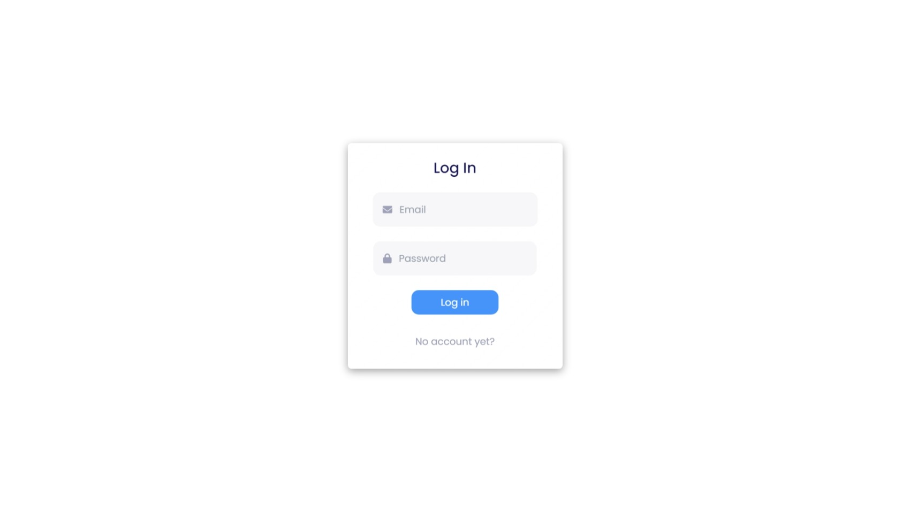
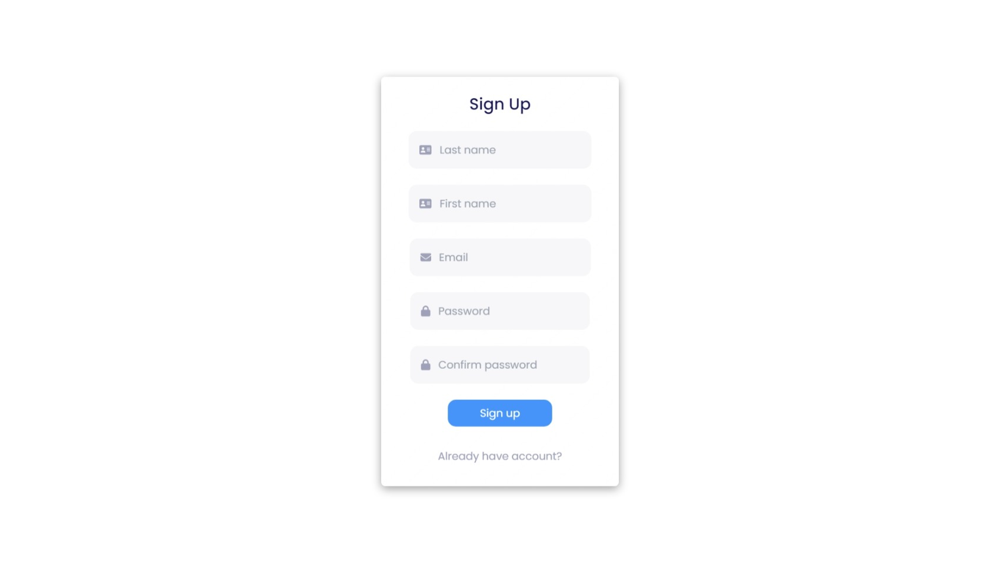
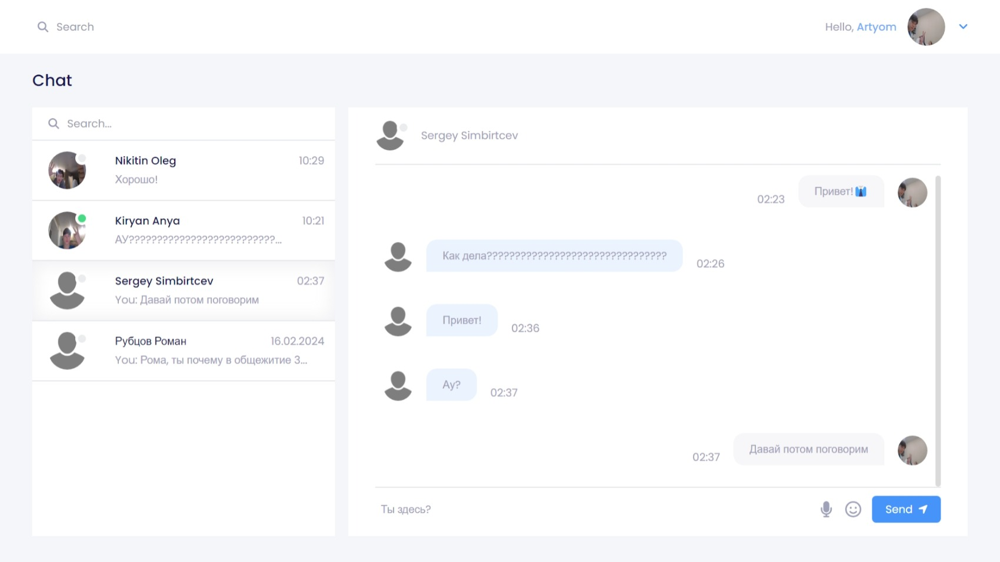
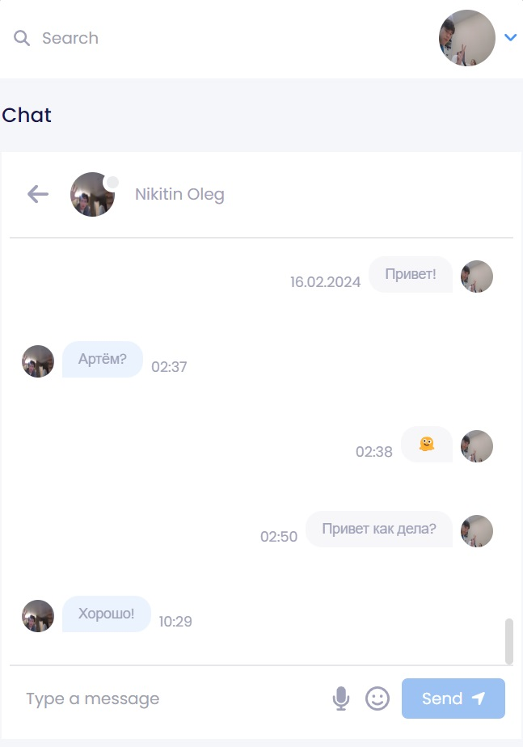
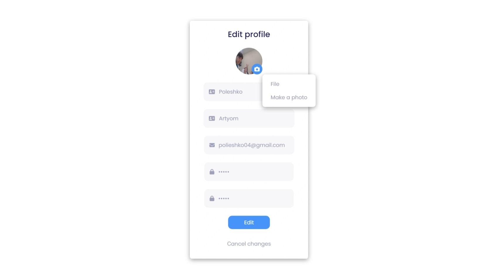
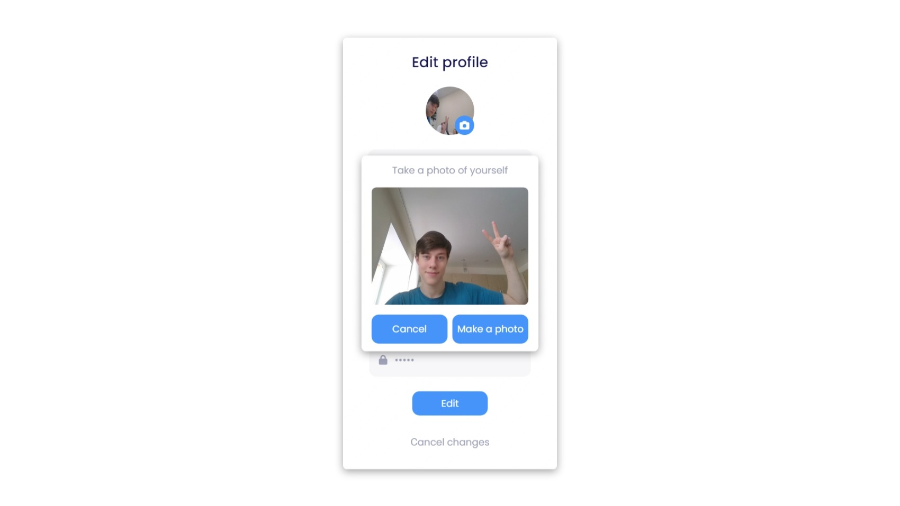

# Адаптивный чат с поддержкой распознавания речи
---

## Старт проекта
1. Клиентская часть
    - ```cd .\client\ ```
    - ```npm run dev```
2. Серверная часть
    - ```cd .\server\```
    - ```npm run dev```
    - Наличие четырех коллекций в бд:
        - users
        - rooms
        - messages
        - sockets
---

## Функционал
#### 1. Возможность отправлять и получать сообщения в реальном времени
#### 2. Выбор собеседника для диалога
#### 3. Поиск нужного пользователя
#### 4. Распознавание речи в текстовый формат для последующего формирования сообщения
#### 5. Авторизация и регистрация пользователя
#### 6. Редактирование профиля, изменение автара с помощью файла или снимка своей камеры
#### 7. Возможность отправлять эмоции
---


## Используемые технологии
#### 1. Клиентская часть:
- react, react-dom, react router v6, vite
- tailwind, materialui, fontawesome
- axios, use-immer, yup
#### 2. Серверная часть: 
- nodejs, express, mongoose
- axios, socket.io
- dotenv, cors

## Преимущества
#### 1. Адаптивность приложения под любые устройства
#### 2. Простой и понятный интерфейс
#### 3. Удобство работы с пользователем (обработка ошибок и их отображение)
#### 4. Возможность ввода текстового сообщения с помощью речи, что улучшает ux пользователя

---

<figure align="center">
  
  <figcaption>Страница авторизации</figcaption>
</figure>

---

<figure align="center">
  
  <figcaption>Страница регистрации</figcaption>
</figure>

---

<figure align="center">
  
  <figcaption>Чат</figcaption>
</figure>

---

<figure align="center">
  
  <figcaption>Чат с мобильного устройства</figcaption>
</figure>

---

<figure align="center">
  
  <figcaption>Страница редактирования</figcaption>
</figure>

---

<figure align="center">
  
  <figcaption>Камера</figcaption>
</figure>

---